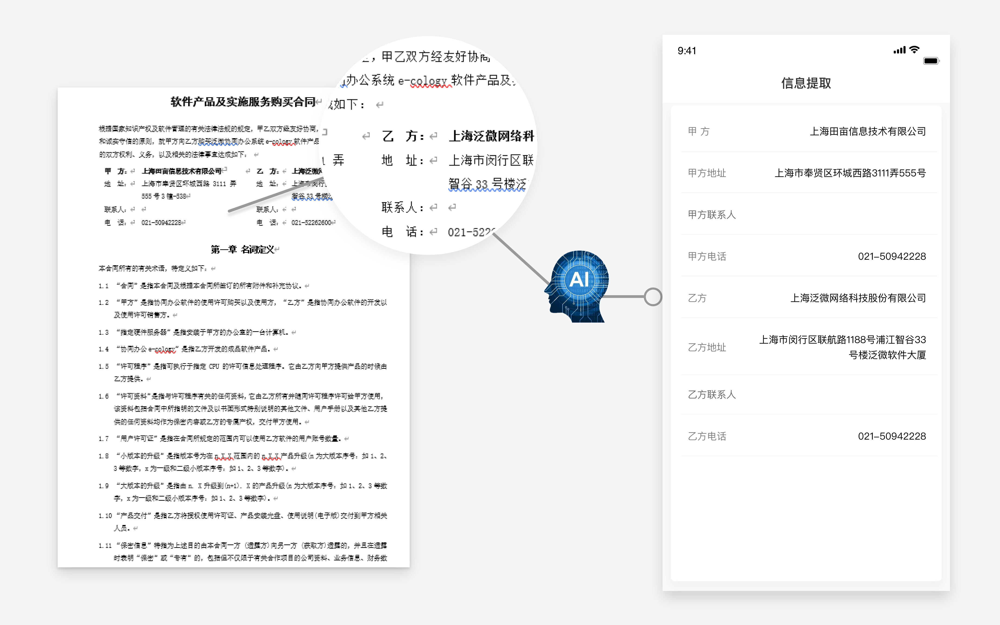

## 1. 简历智能抽取服务  

### 1.1 服务说明  

简历智能抽取服务提供从简历文件中抽取关键信息的能力，例如姓名，联系电话，邮箱等。  

  


### 1.2 调用方式  

- 开放接口地址：https://open.easst.cn/openapi/rest/resume  
- 接口请求类型：POST  
- 请求头(Headers): Content-Type: multipart/form-data
- 请求参数：  

| 字段 | 是否必填 | 类型 | 描述 | 示例值 |
| :------: | :-------: | :--------: | :-----: | :-----: |
| file | 可选，与resume选其一 | 	MultipartFile | 上传 PDF 文件 | 张三简历.pdf |
| resume | 可选，与file选其一 | String | 上传纯文本（字符串） | “张三的简历……” |
| type | 必填 | String | 用于指定简历的识别模式："pdf" —— 上传PDF文件；"txt"——上传纯文本字符串 | pdf |
| channel | 非必填 | String | 渠道 (非必填，不超过20个字符) ||

- 返回数据格式：json  
- 返回数据示例：  
``` js
{
  "result":{
		"入学时间": ["2016年9月"],
		"出生日期": ["1998-07"],
		"姓名": ["马凯"],
		"学位": ["本科"],
		"学历": ["本科"],
		"岗位名称": ["前端开发工程师"],
      ......
  },
	"state":"success",
	"info":"successfully"
}
```
- 返回数据字段包括以下项：  
<table>
    <tr>
        <td>分类</td>
        <td>字段名称</td>
    </tr>
    <tr>
        <td rowspan="11">个人信息</td>
        <td>姓名 &emsp;&emsp;&emsp;&emsp;&emsp;&emsp;&emsp;&emsp;&emsp;&emsp;&emsp;&emsp;&emsp;&emsp;&emsp;</td>
    </tr>
    <tr>
        <td>性别 </td>
    </tr>
    <tr>
        <td>年龄 </td>
    </tr>
    <tr>
        <td>籍贯 </td>
    </tr>
    <tr>
        <td>手机号 </td>
    </tr>
    <tr>
        <td>电子邮箱 </td>
    </tr>
    <tr>
        <td>手机号 </td>
    </tr>
    <tr>
        <td>微信 </td>
    </tr>
    <tr>
        <td>QQ </td>
    </tr>
    <tr>
        <td>现居住地 </td>
    </tr>
    <tr>
        <td>个人评价 </td>
    </tr>
    <tr>
        <td rowspan="7">学业信息</td>
        <td>毕业院校 </td>
    </tr>
    <tr>
        <td>就读时期 </td>
    </tr>
    <tr>
        <td>毕业时间 </td>
    </tr>
    <tr>
        <td>最高学历 </td>
    </tr>
    <tr>
        <td>最高学位 </td>
    </tr>
    <tr>
        <td>专业 </td>
    </tr>
    <tr>
        <td>专业技能 </td>
    </tr>
    <tr>
        <td rowspan="8">工作信息</td>
        <td>期望从事岗位 </td>
    </tr>
    <tr>
        <td >期望工作地点 </td>
    </tr>
    <tr>
        <td >期望薪资 </td>
    </tr>
    <tr>
        <td >工作单位 </td>
    </tr>
    <tr>
        <td>岗位名称 </td>
    </tr>
    <tr>
        <td>工作经验 </td>
    </tr>
    <tr>
        <td>工作经历 </td>
    </tr>
    <tr>
        <td>项目经历 </td>
    </tr>
</table>  


## 2. 招标文档智能抽取服务  

### 2.1 服务说明  

招标文档抽取服务提供从招标⽂档中抽取关键信息的能力，例如招标项⽬名称，招标单位名称等。

  


### 2.2 调用方式  

- 开放接口地址：https://open.easst.cn/openapi/rest/bid  
- 接口请求类型：POST  
- 请求头(Headers)：Content-Type: application/json  
- 请求参数：  

| 字段 | 类型 | 描述 |
| :-----: | :-----: | :-----: |
| text | String | 文本内容（纯文本或HTML网页文本） |
| channel | String | 渠道 (非必填，不超过20个字符) |


- 返回数据格式：json
- 返回数据示例：  

``` js
{
    "result":{
			  "地区": [
          "湖北省武汉市江岸区"
        ],
        "投标截止时间": [
          "2022-05-31"
        ],
        "招标代理机构单位名称": [
          "xx市xx建设工程造价咨询有限公司"
        ],
        "招标代理机构单位地址": [
          "xx市xx区xxx路xx附46-47"
        ],
        "招标代理机构联系人": [
          "黄x",
          "梁x玉"
        ],
        "招标代理机构联系电话": [
          "027-8xxxx889",
          "027-8xxxx367"
        ],
        "招标单位名称": [
          "xx市xx区xx小学"
        ],
        "招标单位地址": [
          "湖北省xx市xx区xx街xx号"
        ],
        "招标发布时间": [
          "2022-05-15"
        ],
        "项目名称": [
          "xx小学义务教育现代化建设项目（EPC）"
        ],
        "项目编号": [
          "WHQS-GC-2022-082"
        ],
        "开标日期": [
          "2022-05-31"
        ],
        "项目预算": [
          "1266000.00"
        ]
    },
    "state":"success",
    "type":"zhaobiao"
}
```

- 返回的数据字段包括以下项：  

<table>
    <tr>
        <td>分类</td>
        <td>字段名称 &emsp;&emsp;&emsp;&emsp;&emsp;&emsp;&emsp;&emsp;&emsp;&emsp;&emsp;&emsp;&emsp;&emsp;&emsp;</td>
    </tr>
    <tr>
        <td rowspan="8">招标单位相关 </td>
        <td>招标单位名称</td>
    </tr>
    <tr>
        <td>招标单位联系人 </td>
    </tr>
    <tr>
        <td>招标单位联系电话 </td>
    </tr>
    <tr>
        <td>招标单位地址 </td>
    </tr>
    <tr>
        <td>招标代理机构联系⼈ </td>
    </tr>
    <tr>
        <td>招标代理机构联系电话 </td>
    </tr>
    <tr>
        <td>招标代理机构单位名称 </td>
    </tr>
    <tr>
        <td>招标代理机构单位地址 </td>
    </tr>
    <tr>
        <td rowspan="14"> 项目相关</td>
        <td>项目名称 </td>
    </tr>
    <tr>
        <td>项目编号 </td>
    </tr>
    <tr>
        <td>项目所在地 </td>
    </tr>
    <tr>
        <td>项目预算 </td>
    </tr>
    <tr>
        <td>开标日期 </td>
    </tr>
    <tr>
        <td>投标截止时间 </td>
    </tr>
    <tr>
        <td>公告发布时间 </td>
    </tr>
</table>  


## 3. 中标文档智能抽取服务  

### 3.1 服务说明 

中标文档抽取服务提供从中标⽂档中抽取关键信息的能力，例如招标项⽬名称，第⼀中标供应商单位名称等。  

  

### 3.2 调用方式  

- 开放接口地址：https://open.easst.cn/openapi/rest/winTheBid  
- 接口请求类型：POST  
- 请求头(Headers)：Content-Type: application/json  
- 请求参数：  

| 字段 | 类型 | 描述 |
| :-----: | :-----: | :-----: |
| text | String | 文本内容（纯文本或HTML网页文本） |
| channel | String | 渠道 (非必填，不超过20个字符) |

- 返回数据格式：json  
- 返回数据示例：  

``` js
{
    "result":{
        "公告发布日期": [
          "2022-04-21"
        ],
        "开标日期": [
          "2022-04-21"
        ],
        "招标代理机构单位名称": [
          "xx市xx招投标代理有限公司"
        ],
        "招标代理机构单位地址": [
          "xx市xx街道xxx路xx号"
        ],
        "招标代理机构联系人": [
          "张x亮"
        ],
        "招标单位名称": [
          "xx市xx开发建设有限责任公司"
        ],
        "招标单位联系人": [
          "金先生"
        ],
        "招标单位联系电话": [
          "138xxxx9633"
        ],
        "第一中标供应商中标价格": [
          "9.20元/平方米"
        ],
        "第一中标供应商单位名称": [
          "xx市xxxx服务有限公司"
        ],
        "第一中标供应商地址": [
          "xx市xx街道xxxx小区"
        ],
        "评审小组成员": [
          "袁x荣",
          "卢x花",
          "陈x标",
          "陈x燕",
          "卢x燕"
        ],
        "项目名称": [
          "xx企业培育中心（一期、二期、三期）物业服务市场化采购项目"
        ],
        "项目编号": [
          "JCZFCG2022-Q15-C259"
        ]
    },
    "state":"success",
    "type":"zhongbiao"
}
```

- 返回数据字段包括以下项：  

<table>
    <tr>
        <td >分类 &emsp;&emsp;&emsp;&emsp;&emsp;&emsp;</td>
        <td>字段名称 &emsp;&emsp;&emsp;&emsp;&emsp;&emsp;&emsp;&emsp;&emsp;&emsp;&emsp;&emsp;&emsp;&emsp;&emsp;</td>
    </tr>
    <tr>
        <td rowspan="4">招标单位相关 </td>
        <td> 招标单位名称 </td>
    </tr>
    <tr>
        <td>招标单位联系人 </td>
    </tr>
    <tr>
        <td>招标单位联系电话 </td>
    </tr>
    <tr>
        <td>招标单位地址 </td>
    </tr>
    <tr>
        <td rowspan="6">项目相关 </td>  
        <td>项目名称</td>
    </tr>
    <tr>
        <td>项目编号 </td>
    </tr>
    <tr>
        <td>总中标金额 </td>
    </tr>
    <tr>
        <td>评审小组成员 </td>
    </tr>
    <tr>
        <td>开标日期 </td>
    </tr>
    <tr>
        <td>公告发布时间 </td>
    </tr>
    <tr>
        <td rowspan="9">供应商相关</td>
        <td>中标供应商单位名称 </td>
    </tr>
    <tr>
        <td>第⼀中标供应商中标价格 </td>
    </tr>
    <tr>
        <td>第⼀中标供应商地址 </td>
    </tr>
    <tr>
        <td>第二中标供应商单位名称 </td>
    </tr>
    <tr>
        <td>第二中标供应商中标价格 </td>
    </tr>
    <tr>
        <td>第二中标供应商地址 </td>
    </tr>
    <tr>
        <td>第三中标供应商单位名称 </td>
    </tr>
    <tr>
        <td>第三中标供应商中标价格 </td>
    </tr>
    <tr>
        <td>第三中标供应商地址 </td>
    </tr>
    <tr>
        <td rowspan="4">招标代理信息 </td>
        <td>招标代理机构单位名称 </td>
    </tr>
    <tr>
        <td>招标代理机构联系人 </td>
    </tr>
    <tr>
        <td>招标代理机构联系电话 </td>
    </tr>
    <tr>
        <td>招标代理机构单位地址 </td>
    </tr>
</table>  


## 4. 合同文件智能抽取服务  

### 4.1 服务说明  

合同文件抽取服务提供从合同文件中抽取关键信息的能力，例如合同名称，合同编号等。  

  

### 4.2 调用方式  

- 开放接口地址：https://open.easst.cn/openapi/rest/contract
- 接口请求类型：POST  
- 请求头(Headers): Content-Type: multipart/form-data
- 请求参数：  

| 字段 | 类型 | 描述 | 示例值 |
| :------: | :-------: | :--------: | :-----: |
| file | 	MultipartFile | 描述 |    |
| type | String | 目前支持“PDF/DOCX”格式 | pdf,docx | 
| channel | String | 渠道 (非必填，不超过20个字符) | 

- 返回数据格式：json  
- 返回数据示例：  

``` js  
{
    "info":"",
    "result":{
        "tags":{
            "乙方名称":[
                "上海泛微网络科技股份有限公司"
            ],
            "乙方地址":[
                "上海市闵行区联航路 1188 号 浦江智谷 33 号楼泛微软件大 厦"
            ],
            "乙方开户行名称":[
                "中国民生银行浦东支行"
            ],
            "乙方银行账号":[
                "0202014170007220"
            ],
            "合同份数":[
                "两份"
            ],
            "合同名称":[
                "软件产品及实施服务购买合同"
            ],
            "合同金额小写":[
                "844,000"
            ],
            "甲方名称":[
                "上海田亩信息技术有限公司",
            ],
            "甲方地址":[
                "上海市奉贤区环城西路3111弄",
            ],
            "税率":[
                "13%"
            ],
            "签订时间":[
                "2021 年 9 月 18 日"
            ],
            "诉讼法院":[
                "人民法院"
            ]
        }
    },
    "state":"success"
}

```

- 返回数据字段包括以下项：  

<table>
    <tr>
        <td>分类</td>
        <td>字段名称</td>
    </tr>
    <tr>
        <td rowspan="6">合同信息 </td>
        <td>合同名称 &emsp;&emsp;&emsp;&emsp;&emsp;&emsp;&emsp;&emsp;&emsp;&emsp;&emsp;&emsp;&emsp;&emsp;&emsp;</td>
    </tr>
    <tr>
        <td>合同份数 </td>
    </tr>
    <tr>
        <td>合同金额小写 </td>
    </tr>
    <tr>
        <td>税率 </td>
    </tr>
    <tr>
        <td>签订时间 </td>
    </tr>
    <tr>
        <td>诉讼法院 </td>
    </tr>
    <tr>
        <td rowspan="10"> 甲/乙方信息</td>
        <td>甲方名称 </td>
    </tr>
    <tr>
        <td>甲方地址 </td>
    </tr>
    <tr>
        <td>甲方开户行名称 </td>
    </tr>
    <tr>
        <td>甲方银行账号 </td>
    </tr>
    <tr>
        <td>乙方名称 </td>
    </tr>
    <tr>
        <td>乙方地址 </td>
    </tr>
    <tr>
        <td>乙方开户行名称 </td>
    </tr>
    <tr>
        <td>乙方银行账号 </td>
    </tr>
</table>  


## 5. 合同文档智能比对服务

### 5.1 服务说明

智能比对不同格式合同文档，精准识别文档之间的差异内容，包含增加、删除、修改等差异类型，提升人工比对的效率。

### 5.2 调用方式

- 开放接口地址：https://open.easst.cn/openapi/rest/common/contract_comparision

- 接口请求类型：POST  

- 请求头(Headers): Content-Type: multipart/form-data

- 请求参数：

  当前文档参数支持格式：docx、pdf、jpg、jpeg、png

  |    字段     |     类型      |       描述        | 示例值  |
  | :---------: | :-----------: | :---------------: | :-----: |
  |    file1    | MultipartFile |     基准文档      |         |
  |    file2    | MultipartFile |     比对文档      |         |
  | ignore_punc |    String     | "true" or "false" | "false" |

- 返回数据格式：json

- 返回数据示例： 

  字段说明

  - diff_info --> diff_type: 修改类型（delete、insert、change）
  - diff_info --> ori --> diff_text : 基准文档中修改处内容
  - diff_info --> ori --> diff_text_segment: 基准文档中修改处内容的上下文信息
  - diff_info --> ori --> idx: 基准文档中 diff_text 在 diff_text_segment 中的索引区间（便于高亮显示）
  - diff_info --> ori --> positions: 基准文档中 diff_text 在页面中的具体位置（页数从0开始）
  - diff_info --> new 中的字段类似 diff_info --> ori 解释
  - file1_img 基准文档每一页图片对应的base64列表
  - file2_img 比对文档每一页图片对应的base64列表

  ```json
  {
      "isSuccess": true,
      "data": {
          "diff_info": [
              {
                  "ori": {
                      "diff_text": "UXUE",
                      "diff_text_segment": "统一社会信用代码：10118903345623UXUE",
                      "idx": [
                          [
                              23,
                              27
                          ]
                      ],
                      "positions": [
                          {
                              "page": 0,
                              "box": [
                                  [
                                      339,
                                      86
                                  ],
                                  [
                                      379,
                                      86
                                  ],
                                  [
                                      379,
                                      120
                                  ],
                                  [
                                      339,
                                      120
                                  ]
                              ]
                          }
                      ]
                  },
                  "new": {
                      "diff_text": "AABB",
                      "diff_text_segment": "统一社会信用代码：10118903345623AABB",
                      "idx": [
                          [
                              23,
                              27
                          ]
                      ],
                      "positions": [
                          {
                              "page": 0,
                              "box": [
                                  [
                                      339,
                                      83
                                  ],
                                  [
                                      379,
                                      83
                                  ],
                                  [
                                      379,
                                      118
                                  ],
                                  [
                                      339,
                                      118
                                  ]
                              ]
                          }
                      ]
                  },
                  "diff_type": "change"
              },
              {
                  "ori": {
                      "diff_text": "佰",
                      "diff_text_segment": "额人民币（大写）柒佰万元（¥7000000",
                      "idx": [
                          [
                              9,
                              10
                          ]
                      ],
                      "positions": [
                          {
                              "page": 0,
                              "box": [
                                  [
                                      223,
                                      346
                                  ],
                                  [
                                      242,
                                      346
                                  ],
                                  [
                                      242,
                                      386
                                  ],
                                  [
                                      223,
                                      386
                                  ]
                              ]
                          }
                      ]
                  },
                  "new": {
                      "diff_text": "",
                      "diff_text_segment": "",
                      "positions": [
                          {
                              "page": 0,
                              "box": [
                                  [
                                      211,
                                      346
                                  ],
                                  [
                                      221,
                                      346
                                  ],
                                  [
                                      221,
                                      383
                                  ],
                                  [
                                      211,
                                      383
                                  ]
                              ]
                          }
                      ]
                  },
                  "diff_type": "delete"
              },
              {
                  "ori": {
                      "diff_text": "",
                      "diff_text_segment": "",
                      "positions": [
                          {
                              "page": 0,
                              "box": [
                                  [
                                      136,
                                      575
                                  ],
                                  [
                                      146,
                                      575
                                  ],
                                  [
                                      146,
                                      611
                                  ],
                                  [
                                      136,
                                      611
                                  ]
                              ]
                          }
                      ]
                  },
                  "new": {
                      "diff_text": "88",
                      "diff_text_segment": "（年利率 4.888%或月利率5",
                      "idx": [
                          [
                              7,
                              9
                          ]
                      ],
                      "positions": [
                          {
                              "page": 0,
                              "box": [
                                  [
                                      146,
                                      573
                                  ],
                                  [
                                      167,
                                      573
                                  ],
                                  [
                                      167,
                                      609
                                  ],
                                  [
                                      146,
                                      609
                                  ]
                              ]
                          }
                      ]
                  },
                  "diff_type": "insert"
              }
          ],
          "file1_img": [
              "base64"
          ],
          "file2_img": [
              "base64"
          ]
      }
  }
  ```


## 6. 通用文字识别服务

### 6.1 服务说明

通用文字识别服务提供对图片上的文字内容进行提取的功能，目前只支持中文数字版文字识别。

### 6.2 调用方式

- 开放接口地址：https://open.easst.cn/openapi/rest/common/ocr

- 接口请求类型：POST

- 请求头(Headers): Content-Type: multipart/form-data

- 请求参数：

  | 字段 |     类型      |   描述   | 示例值 |
  | :--: | :-----------: | :------: | :----: |
  | img  | MultipartFile | 图片文件 |        |

- 返回数据格式：json

- 返回数据示例： 

  字段说明

  data --> result 类型为 `List(Dict)`  `Dict`为每个文本框的识别文字及位置信息

  - box_text_conf
    - 第一个元素为当前文本框的内容
    - 第二个元素为识别文字的置信度，越大表示识别的越准确
  - box_pos 当前文本框的四个点坐标（左上 --> 右上 --> 右下 --> 左下）

```json
{
    "isSuccess": true,
    "data": {
        "result": [
            {
                "box_text_conf": [
                    "办公自动化管",
                    0.898865
                ],
                "box_pos": [
                    [
                        4,
                        7
                    ],
                    [
                        123,
                        7
                    ],
                    [
                        123,
                        27
                    ],
                    [
                        4,
                        27
                    ]
                ]
            }
        ]
    }
}
```


## 7. 情感智能分析服务

### 7.1 服务说明

为提供的文本分析其中的情感倾向，以及包含的观点（目前支持的观点有限）。

### 7.2 调用方式

- 开放接口地址：https://open.easst.cn/openapi/rest/sentiment_openapi  
- 接口请求类型：POST  
- 请求头(Headers)：Content-Type: application/json  
- 请求参数：  

|  字段   |  类型  |               描述               |
| :-----: | :----: | :------------------------------: |
|  text   | String | 文本内容（纯文本或HTML网页文本） |
| channel | String |  渠道 (非必填，不超过20个字符)   |

- 返回数据格式：json  

- 返回字段说明

|      字段      |      类型       |                            描述                            |
| :------------: | :-------------: | :--------------------------------------------------------: |
| opinion -> pos | `Array[string]` | 正面观点（存在重复及空观点，用于统计观点个数，需自行处理） |
| opinion -> neg | `Array[string]` | 负面观点（存在重复及空观点，用于统计观点个数，需自行处理） |
|   proportion   |     `Float`     |                  ***正面*** 情感倾向占比                   |
|   sentiment    |    `String`     |                情感类别（中性、积极、消极）                |

- 返回数据示例：  

``` js
{
  "data": {
    "opinion": {
      "neg": [
        "融资成本增加"
      ],
      "pos": [
        "积极合作",
        "经营顺利",
        "布局广泛",
      ]
    },
    "proportion": "积极",
    "sentiment": 0.8
  },
  "errorMsg": "",
  "isSuccess": true
}
```

