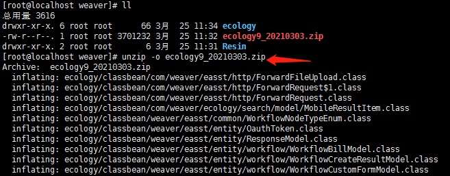

## 1. 部署条件  

- ecology版本E8，KB1710以上。
- 部署小e的ecology必须可以外网访问或通过代理把/mobile/plugin/siri/** 代理到外网，因为小e云需要访问e-cology系统拉取名词数据如人名，流程名，做语音文字的分词和解析。
- 如果外网访问ecology或代理需要ip授权，把123.60.36.64、121.36.253.17加入白名单。确保小e云可以访问到客户的ecology接口。
- 需部署微搜服务（小e语音解析及意图识别为云部署，暂时不支持私有部署）

## 2. 如何部署  

### 2.1 部署到Emobile7（E9）  

::: tip 第一步：补丁包覆盖
将非标补丁包覆盖到ecology上，并重启ecology服务。  
:::
1. 向公司申请‘小e’非标功能，并下载非标文件。例如：ecology9_20210303.zip
2. 文件上传到客户OA服务器，位于 ecology同级目录。  
Linux示例：  
  

3. 解压并覆盖  
  

4. 停止并重启ecology

  

::: tip 第二步：注册移动端小e助手入口
ecology重启成功后，非标补丁会在ecology后台集成中心->移动应用配置中心自动注册小e助手应用。 将该应用配置到emobile、企业微信、钉钉作为入口打开小e助手的位置。
:::
1. 非标补丁包，在客户部署后。ecology重启时，会自动注册‘自定义应用’  

2. 用sysadmin管理员账号登录OA。访问 ‘后端应用中心-->集成中心-->移动应用配置中心-->移动平台应用管理’页面。  

3. 搜索‘小e’，能够出现3个应用。‘小e助手(emobile)、小e助手(企业微信)、小e助手(钉钉)’

  

4. 示例：将小e应用配置到emobile7工作台。  
   后端应用中心-->集成中心-->移动应用配置中心-->应用入口页面管理，点击启用的页面。

  

  在显示的工作台中，点击添加应用。  

  

注意：如果没有显示“移动应用配置中心”，到“应用中心”点击“非标功能管理”，启用“移动平台配置中心”和“小e助手”  

 

  登陆小e管理后台，点击新增加的应用图标，修改显示名称。  

  

  登录手机端emobile。打开工作台就有小e功能了。    

5. 配置小e助手到 ‘钉钉，企业微信’需要先发布。然后到 客户的 ‘钉钉，企业微信’ 的管理后台，配置并修改小e助手名称。  

::: tip 第三步：小e助手云端关联注册
 1. 参照此文档<小e后台管理系统说明>完成小e后台账号注册和客户关联。  
 2. 参照此文档<小e后台管理系统说明>确认客户的基本信息，进入客户的客户信息管理页面完成基本信息设置和关联。
    如果需要使用企业微信或钉钉，也需要完成相应的配置。
:::

### 2.2 部署到企业（政务）微信（E9）

- 请先参考上一节内容  
1. 如果没有现成可以使用的企业微信，可以自己去申请一个企业微信。申请操作： 
[申请企业微信]https://jingyan.baidu.com/article/0a52e3f4f8b2aebf62ed72d6.html  

2. 去ecology后台集成中心-应用管理那里找到小e企业微信的应用，点击发布  
   

3. 企业微信（政务微信）一定要在小e管理后台配置检测通过才能使用。  

  

- 注：配置企业微信不需要填写微信域名，其他步骤与配置政务微信一致。  

4. 政务微信ID是用的企业CorpID，可以在如下地方获取：  
  

5. 政务微信Secrect和配置可信域名均在政务微信管理后台获取和配置。  

  

  

企业微信（公有云、私有云可外网访问、私有云仅内网访问）可信域名：只需要配置客户的ecology域名。  

或者如下界面:  

  

  

1. 配置了‘可调用JS-SDK、跳转小程序的可信域名’，这些域名能访问企业微信了,但这些域名的程序还不能使用微信的JS-SDK。
2. 因为这些程序是不可信的,所以需要‘申请校验域名’。
3. 点击‘申请校验域名’会下载一个校验后的文件。文件名示例：WW_verify_0LSfsCix78T6NJhf.txt
4. 把下载的校验文件放在配置的‘可调用JS-SDK、跳转小程序的可信域名’应用程序根目录（直接放ecology目录下）。例如：ecology应用程序的根目录是/oa/weaver/ecology/，放置后/oa/weaver/ecology/WW_verify_0LSfsCix78T6NJhf.txt  

  

配置好后,如下图所示 :

  

### 2.3 部署到Emobile6（E8）  
 
::: tip 第一步：补丁包覆盖
将非标补丁包覆盖到ecology上，并重启ecology服务。  
:::

::: tip 第二步：注册移动端小e助手入口
ecology重启成功后，进入e-mobile移动门户管理平台,在应用中心的"自定义"tab页新建小e的应用,建立好后,在应用设置里可以进行编辑操作。
:::

  

  

### 2.4 部署到企业（政务）微信（E8）

#### 2.3.1 E8--云桥企业微信配置小e应用入口  

E8云桥企业微信，部署小e非标补丁包后，增加小e应用入口,企业微信上就能出现‘小e助手’。

微信效果如下:  
  

直接在云桥配置应用  
  

  

如下图所示配置小e主页地址

  

#### 2.3.2 部署企业微信  

1. 企业微信（政务微信）一定要在小e管理后台配置检测通过才能使用。  

  

- 注：配置企业微信不需要填写微信域名，其他步骤与配置政务微信一致。  

2. 政务微信ID是用的企业CorpID，可以在如下地方获取：  
  

3. 政务微信Secrect和配置可信域名均在政务微信管理后台获取和配置。  

  

  

企业微信（公有云、私有云可外网访问、私有云仅内网访问）可信域名：只需要配置客户的ecology域名  

或者如下界面:  

  

  

1. 配置了‘可调用JS-SDK、跳转小程序的可信域名’，这些域名能访问企业微信了,但这些域名的程序还不能使用微信的JS-SDK。
2. 因为这些程序是不可信的,所以需要‘申请校验域名’。
3. 点击‘申请校验域名’会下载一个校验后的文件。文件名示例：WW_verify_0LSfsCix78T6NJhf.txt
4. 把下载的校验文件放在配置的‘可调用JS-SDK、跳转小程序的可信域名’应用程序根目录（直接放ecology目录下）。例如：ecology应用程序的根目录是/oa/weaver/ecology/，放置后/oa/weaver/ecology/WW_verify_0LSfsCix78T6NJhf.txt  

  

配置好后,如下图所示 :

  

### 2.5 网络环境注意事项 

客户ecology、企业微信私有云是内网时：  
::: tip  网络请求方向：小e云发请求给客户  
1、客户那边的网络环境，需要允许小e的两个服务器地址123.60.36.64,121.36.253.17，访问到客户的‘内网ecology、内网的企业微信私有云’。  
2、若客户那边不允许‘内网的ecology服务器、企业微信私有云服务器’，直接暴露在外网。  
3、需要有一台连了外网的服务器，允许接收小e的两个服务器地址123.60.36.64,121.36.253.17发来的请求，并把请求代理到‘内网的ecology、企业微信私有云’。 
:::

::: tip 网络配置办法  
1、联系客户的网管修改路由规则，把123.60.36.64,121.36.253.17 这2个ip加入到白名单。  
2、配置允许这2个ip发来的 ‘所有请求’ 或 ‘所有/mobile/plugin/*的请求’。  
3、若需要代理转发，这2个ip发来的 ‘所有请求’ 或 ‘所有/mobile/plugin/*的请求’ 都代理掉，代理可以用nginx或其他。  
:::  

:::tip 网络请求方向：客户发请求给小e云  
1、添加了小e助手的EM或企业微信。手机使用的网络能对外网发起请求，发送到ai.easst.cn。    
2、如果手机使用的网络是客户自己的内网，并禁止外网访问。需要把ai.easst.cn加入白名单，允许访问到ai.easst.cn这个外网地址。  
:::

::: tip  网络配置办法
联系客户的网管,修改路由规则，把ai.easst.cn加入到白名单,允许访问到ai.easst.cn这个外网地址。  
:::  

::: tip 网络请求方向：客户发请求给高德地图  
1、客户那边的网络环境，需要允许ecology服务器访问外网地址restapi.amap.com（高德地图）。
:::  

::: tip 网络配置办法
联系客户的网管修改白名单，把restapi.amap.com 这个域名加入到白名单。
:::

## 3. 终端环境  

- emobile
- 企业微信
- 钉钉

## 4. 关联域名  

注册登录小e后台管理系统, 关联客户后即可看到客户信息  

  

如果客户没有关联系统域名，需要在客户的基本信息中关联系统域名，如下图所示：  

  