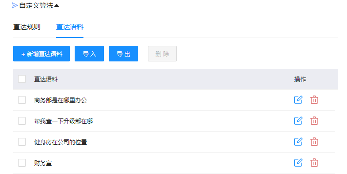
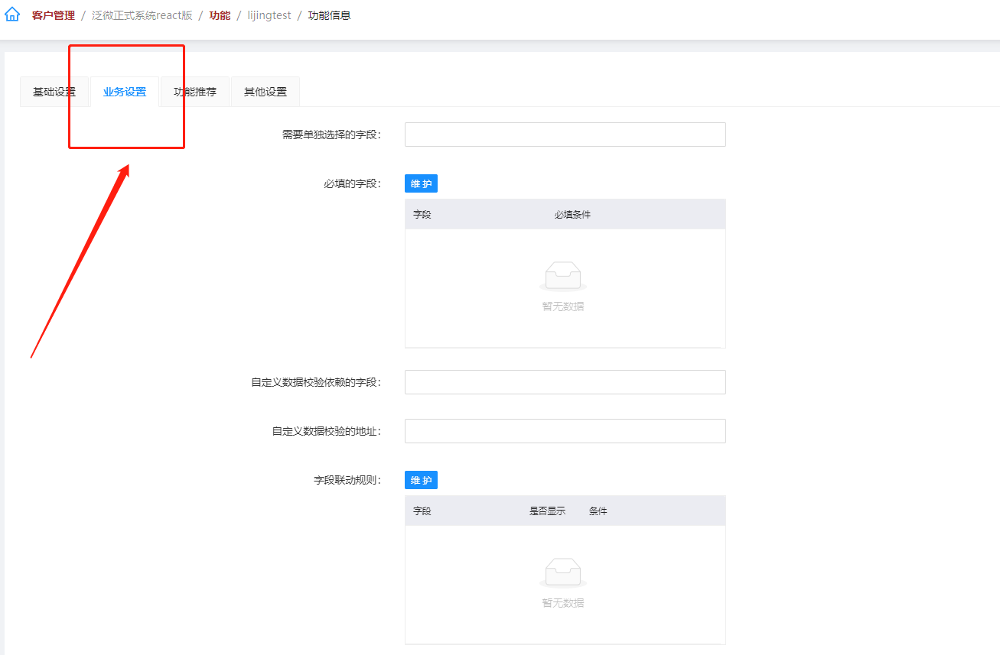
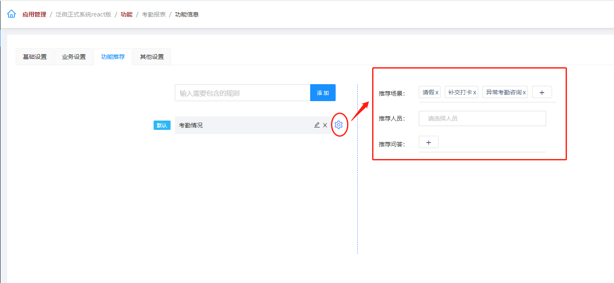

## 1.场景管理  
### 1.1 场景分类  
在"场景管理-->场景分类"下可以查看标准场景和新增自建场景。  
  
::: tip 标准场景  
- 以标准场景“考勤管理>请假”为例，可以查看请假场景的场景名称和关联的功能。  
- 系统功能一般不需要添加自定义算法，如果系统内置算法没有识别到某些语料，且没有反馈相应的场景，可在自定义算法中添加直达规则或者直达语料提高该场景的识别率。
:::  

   

::: tip 关闭和开启标准场景  
如果不想使用某个标准场景，可以点击下图所示图标，关闭相应的标准场景。  
:::  
  

  

::: tip 自建场景  
- 标准场景中没有客户需要的场景，可以在自建场景中先创建场景分类，然后再创建场景。  
- 创建完成场景后，添加自定义算法。  
:::  

  

  

::: tip 自定义算法：直达规则
用于配置语料中需要强制性识别的文本，按文本规则抽取。
 - <普通文本>：用来直接识别语料中的文本，识别到匹配的文本内容后会直接走此场景的业务内容。配置语料，配置的语料文本，可强制走该场景业务。  

- <正则表达式>：用正则表达式来抽取语料中的关键词、语句等，识别到匹配项会直接走此场景的业务内容。
:::  

  

::: tip 自定义算法：直达语料  
配置语料，配置的语料文本用来直接识别语料中的文本，识别到匹配的文本内容后会直接走此场景的业务内容。公司有常用业务语料，可以添加于每个场景之下，增加算法对该场景的识别能力。
:::  

   

### 1.2 直达汇总  
- 直达规则和直达语料适用于业务性较强或者模型算法暂不支持的场景，这类场景语料按照一定的格式就能匹配到该意图。  
- 此处将所有场景下的直达规则和直达语料汇总在一起，仅用于查看。  

  

### 1.3 识别日志  

查看用户使用小e助手时的对话内容，以及小e助手识别到的场景和功能。  

 

## 2. 功能管理
### 2.1 功能列表  

在“功能管理->功能列表"中包含了标准功能和自建功能。  

::: tip 标准功能  
- 可以看到功能名称和关联场景
- 标准功能也就是系统功能，只能查看不能修改。
:::  

::: tip 自建功能  
- 可以看到功能名称和关联场景
- 自建功能可以增删改查，由用户自定义配置。
:::  

### 2.2 创建功能  

#### 2.2.1 基础设置  

在“功能列表>自建功能”点击左上角 “新增功能” 按钮，新增功能。  

  

::: tip 关联场景  
- 点击加号后，选择要关联的目标场景。
- 关联场景之前，要先在场景管理中建好目标场景。
:::  

::: tip 创建类型：分为"新建功能" & "定制功能"。
- 新建功能：可直接填写"功能名称"和"功能标识"  
- 定制功能：小e后台系统已配置了常用通用于ecology的产品模板，可选择并克隆这些功能配置，再做相应的修改，即可定制化配置这些功能。
:::  

若选择定制功能，出现"是否克隆功能配置"、"选择功能"字段。  

  

::: tip 是否克隆功能的配置  
- 选择<是>：可直接克隆系统已有的功能配置，自动带入功能中的全部配置信息  
- 选择<否>：不克隆功能中的配置信息。
:::  

::: tip 选择功能
选择模板功能（产品自带的一些常用OA功能），会自动带出模板功能的"功能标识"。
:::  
  

::: tip 功能标识
同一客户下不支持创建相同标识的功能，即同一客户下的功能标识都是唯一的。  
（格式仅支持下划线、小数点、英文字母。）
:::  

  

::: tip 功能完成时的回答
- 小e助手端表单上的必填项字段都填写完整后，点击"确认"按钮后显示的话术。  

   

- 当此功能有配置表单字段的时候,这里会有选择代码块的选择框,可以将其加入功能完成时的回答,上图的配置在小e助手实现效果如下图 :  

   

:::  

::: tip 功能取消时的回答
- 小e助手端点击"取消"按钮显示的话术。
- 提示的话是根据后台的配置来显示的。
:::  

::: tip 是否需要确认
- 选择<是>：小e助手端的功能表单必填项全部填写完后，需要手动点击"确认"或语音"确认"，才会提交表单。  
- 选择<否>：小e助手端的表单必填项全部填写完后会自动提交表单，无需确认。
:::  

::: tip 功能最终执行动作
配置需要直接跳转到OA业务接口的地址。
:::  

#### 2.2.2 业务设置

  

(需要先在功能表单增加相应的字段)  

::: tip 需要单独选择的字段  
  
这两处加上要单独选择的字段即可实现如下功能:  

:::  

::: tip 字段联动规则  
  
这里的条件,需要选择词典项的选项id, 即可实现通过选项控制某个字段是否显示的功能 
:::

::: tip 选项联动规则  
  
这里可以实现通过A字段的选项B字段的选项的功能,最常见的功能就是选择国家省份和城市这三个字段  
:::

#### 2.2.3 功能推荐  

::: tip 功能推荐 
- 先添加[包含的规则],这里的规则指的是小e助手端接口返回的数据,可以添加多个规则  
- [默认]表示即使没有命中规则也会显示的功能推荐
- 每个添加的规则都可以配置推荐场景\推荐人员\推荐问答
:::  

  

移动端小e助手显示效果如图所示  

  

#### 2.2.4 其他设置
  
  

::: tip HTML  
用于配置带有格式的文本展示框 , 显示效果如下图:   
  
:::
::: tip 超链接  
用于对小e助手返回结果的补充 , 显示效果如下图:   
  
:::
::: tip 提醒信息  
在提交表单程后，界面会显示一个tips类型的气泡提示,显示效果如下图:

:::
::: tip 离开此功能是否提醒
- 离开当前功能想进入其他功能时，可以二次确认用户是否离开当前功能。
- 默认为"否"，当字段较多时，建议选择"是"。  
- 如：告诉小e “明天出差”（属于 #出差# 功能），再告诉它 "新建日程"就属于离开了当前功能，当离开"请假"功能进入"创建日程"功能前，会提示“要结束当前操作吗”。点击"确认"才会进入"创建日程"功能。
:::
::: tip 是否长会话
是否需要通过多轮会话的方式实现。（一般用于配置一句话就出结果的功能，如 “查询天气”）。
:::
::: tip 是否推荐 
因为用户的话术信息过多，小e给出多个结果供用户选择，不推荐就不会出现在待选列表中。
:::
::: tip 不支持的环境
勾选任意环境保存后，对应环境下该功能被禁止使用。
:::
::: tip 不支持环境的问答
搭配"不支持的环境"使用，用于某环境下不支持的功能的提示语。
:::

### 2.3 管理功能

#### 2.3.1 功能表单
以表单形式完成OA业务操作， 所需填写的字段的配置。可在此做功能表单的字段配置、表单项的增删改查等操作。  

  

- 新增字段  

  
::: tip 字段标题
必填，字段的标题，建议汉字填写。
:::
::: tip 字段名称
必填，创建字段填写的名称，仅支持英文、数字、下划线。创建完成后，字段名称将置灰不可修改。
:::
::: tip 字段别名
字段的其他名称，可填写多个。
::: 
::: tip 字段默认值
可通过表达式，自动将"字段默认值"设定的值，赋予给表单中该字段的默认值。  
比如<申请人>字段，设置了字段默认值 UESR(CURRENT)，将自动带出用户姓名。
:::
  

::: tip 字段类型：选择不同的字段类型，会在表单上显示为不同的输入类型。  
- <日期时间>：选择“年月日时分秒”  
- <日期时间范围>：表单上显示选择时间区域，输入格式为（yyyy-mm-dd hh:mm—yyyy-mm-dd hh:mm ）  
- <单行文本>：单行文本输入框，多用于填写标题等文字较少内容  
- <多行文本>：多行文本输入框，用于填写如文字较多内容的文本输入入口。选择<多行文本>，会带出"字段子类型"选择字段。
:::

::: tip 字段子类型
- <剩余文本>：对小e发出指令的语料中，将整句断句拆分后，获取其中最长的文本作为剩余文本填入字段中，常用于类似需要识别为文本内容记录的表单字段中，如：出差事由、微博内容、消息内容等。  
- <关键字>：选择该项会带出"选择词典"字段。如果在对小e发出指令的语料中，有跟所选词典内的关键字匹配的，则会自动抽取关键字。
- <客户名称>：对于需要查询客户名称或者包含了客户名称信息的功能，可以加一个字段名称为keyword，字段类型为单行文本的字段，字段子类型选择客户名称后，小e助手就会直接通过相应的算法在用户语料中识别出客户名称。
- <流程标题>：对于和流程标题有关的功能，可以加一个字段名称为keyword，字段类型为单行文本的字段，字段子类型选择流程标题后，小e助手就会直接通过相应的算法在用户语料中识别出流程标题。
- <文档名称>：对于需要查询文档功能，可以加一个字段名称为keyword，字段类型为单行文本的字段，字段子类型选择文档名称后，小e助手就会直接通过相应的算法在用户语料中识别出文档名称。
:::  

::: tip 选择词典
字段类型为搜索选项或者下拉选项时，需要选择相应的词典作为选项数据来源。  
（没有词典需要先在《词典管理》中配置好词典，再对应使用。）
:::  

- 快捷创建  

  
填写流程ID后，就可以获取到对应流程在OA中的表单字段了。提高了新增表单字段的效率。

#### 2.3.2 自定义UI  

自定义小e助手意图表单的显示样式、显示数据内容，不做特殊配置可全部选择默认。  

   

::: tip 多选项
- <默认>：小e助手默认的表单样式、默认显示抽取到的全部数据。  
- <从业务系统过滤>：从公司自有OA业务系统过滤数据。填写格式为路径。  
- <业务系统定制>：在公司自有OA业务系统的数据，客户定制更改后的样式。填写格式为路径。  
:::
::: tip 名词解释
- checkIntent：表单中选择不确定场景，场景的数据需要过滤或者定时时的数据显示。  
- checkOne：用小e发出指令的语料中，没有说出需要checkone必填项的内容关键字时，出现checkone选项时的数据显示。  
- checkFrom：表单中需要过滤数据。  
- checkLeave: 离开当前场景提醒时的数据显示。  
- Finish: 完成场景后的数据显示。
:::

## 3 词典管理  

### 3.1 词典介绍  

#### 3.1.1 按来源分类

   

::: tip 标准词典
继承了通用于oa业务端的模板词典，一部分词典已经从ecology端同步过来，即运用了OA业务系统的词典。只可对词典数据进行批量同步（同步ecology端的词典数据）、词典项编辑操作。
:::  

::: tip 自建词典
自定义创建，独立于所继承的产品（已有OA业务系统）只用于小e实现业务表单时，使用的数据选项词典。在这一类下，可新建、编辑、删除词典，也可批量同步数据。  
:::  

#### 3.1.2 按功能分类  

  

::: tip 动态词典
常通过业务系统地址接口获取，词典项数据不是固定的，为动态数据，会随着业务系统的数据变动而发生变化。所以无法直接更改词典项可从OA业务系统获取数据。  

如 {人员信息} 词典，不同的企业人员信息不同，词典数据项就不同。因此要配置相关接口，从企业的业务系统中调出可用数据
:::

::: tip 静态词典
可通配的词典，有固定的内容项，只会根据在此词典配置中增删改而变动。  
（例如“城市”词典，配置项会包含全国固定的城市。）
:::

### 3.2 创建词典  

#### 3.2.1 新增词典  

点击 “自建词典”，新增词典。  

  

::: tip 创建类型  
新建词典：自定义添加词典。  
定制词典：在模板词典的基础上做定制设置，选择该项后，下方会出现"选择词典"字段。
:::  

::: tip 词典标题    
词典标题，用于区分词典的标题名称。
:::  

::: tip 词典名称      
词典的唯一识别标志，只支持英文、数字、下划线。同"标题"的 {词典} ，词典名称不可重复。
:::  

::: tip 词典类型  
选择静态词典或者动态词典。
:::  

::: tip 是否远程查询  
是否需要通过访问业务接口查询词典数据。  
- 选择<是>时，会出现"远程查询的url"字段。  
- 选择<否>时，不从远程url查询。
:::  

::: tip 搜索类型：搜索词典数据的方式  
- 本地精准搜索：从小e后台的数据中查询。  
- 本地模糊搜索：从小e后台搜索引擎查询。 
- 远程搜索：从自有业务系统（ecology、eoffice）查询，选择该项需要填写业务数据接口。  
:::  

::: tip 是否远程替换  
将业务id替换为标题便于展示
:::  

::: tip 数据源  
从业务系统获取基础数据，存储到小e后台作为词典。
:::  

::: tip 抽取配置  
 槽位抽取
:::  

#### 3.2.2 配置词典项  

点击查看词典项图标，进入词典项。可对词典项添加同义词。  
{动态词典}无法手动创建词典项，词典项是由所配置的业务接口获取到的动态数据，会随着业务数据变动。  

  

#### 3.2.3 词典数据更新    

::: tip 同步数据  
修改了静态词典数据后，需点击"同步数据"，小e助手便会使用修改后的数据。  
:::  

::: tip 获取数据  
如果业务系统更新了数据，小e还未获取到数据时，点击"获取数据"即可从业务端口或配置的字段来源获取到业务系统的动态数据。  
:::  

#### 3.2.4 词典管理  

::: tip 编辑词典  
- 动态词典后的"编辑"按钮，可进行编辑词典和移除词典两个操作。  
- 静态词典后的"编辑"按钮，可以进行 编辑词典、查看词典选项、同步数据、移除词典四个操作。
:::  

## 4. 数据子类型  

"数据子类型"也是用于功能表单，用于字段类型为数字的字段，可创建管理不同的数字类型。  

### 4.1 新增子类型  

创建子类型：只支持“数字”类型，通过正则表达式来设置数字的显示方式。  

  
 
::: tip 子类型
- 父类型：只能选择数字，即数据类型，用于配置功能时的"选择子类型"中的配置。
- 子类型名称：设置变量名称，支持英文、数字、下划线。子类型名称不可重复。
- 子类型标题：用于识别名称。可以设置例如“金额、张、通用量词、电话号码、天数“等子类型，配置不同的子类型对数字的格式有不同的定义。
- 子类型排列顺序：自定义配置选项的优先级显示顺序。
- 正则表达式：可参考详细教程[www.runoob.com](https://www.runoob.com/regexp/regexp-tutorial.html)
:::

### 4.2 子类型管理 

在"数据子类型"界面，可以增、删、改、查子类型。若在"功能配置"中使用了子类型，此处的更改也会相应生效，若删除了正在使用的子类型，"功能配置"中使用的子类型则自动失效。  

  

## 5. 变量管理  

- "变量管理"也是用于功能表单，用于配置高级变量，可创建管理不同的变量。

- 可配置各类流程的id值，不同的流程有不同的id值。用于流程路径（workflowId）字段。

- 在出差功能的<流程路径（workflowId）>字段中，其"字段默认值"这一栏便用到了"变量管理"里出差流程对应的变量名。

- 流程路径字段的“字段默认值”也可配置为固定值，直接配置流程id值。

- 只有配置了正确的流程id，用小e提流程的场景才可提交成功，否则无法提交流程。

::: tip 示例：  
用小e提交"出差"流程，提交成功后，OA业务系统中会有对应的出差流程，需要先配置好企业OA系统的接口。如果把 出差功能的表单项 < 流程路径（workflowId）> 字段里配置的“字段默认值”清空保存后，去用小e提交"出差"流程，会直接提示“请求失败”。
:::

### 5.1 新增变量  

点击"创建变量"，开始填写变量信息。  

  

::: tip 创建方式：新建&定制  
- 新建：按照"变量名"、"变量值"、"变量描述"顺序填写配置信息。
- 定制：可直接引用模板的变量信息，点击<定制>后，可直接选择已有变量名，会自动带出其配置信息。
:::

### 5.2 变量管理

在"变量管理"页面，可以新建、编辑、删除子类型，所有客户的变量都在此页面内，便于管理更改。  

  

## 6. 知识问答  

若企业有业务问答需求，即使用小e发出问答指令，算法识别到相似问答，并给出用户相关答案。  

  

### 6.1 新增问答  

一个问题对应一个答案，展示效果如下图所示。  

  

要先在后台新增问答，输入问题和答案，再加上与问题相似的语料即可，还可以选择对应的标签。  

  

### 6.2 标签管理  

在标签管理页面新增标签。  

  

## 7. 智能找人  

适用于公司业务繁杂，需要经常找人办理业务，想解决业务问题又不知道找谁时的场景。当用户对小e提出业务问题时，小e能帮助用户快速找到相关业务人员。

需要在智能找人下关联公司人员词典，配合各个人员职责与可以回答的语料问题，来实现此功能。

  

 ### 7.1 关联词典

点击页面内“关联词典”按钮，选择合适的人员词典，推荐选择“人员信息（标准）”，如下图所示。  
（人员信息词典是从企业的业务系统中拉取的动态词典数据，包含了企业现有人员）

 
关联后便可以获取到业务系统词典内的人员。如果人员词典没有正确关联到，无法添加人员。  

### 7.2 新增人员  
关联词典后，便可以开始创建词典内的人员。点击“新增人员”，填写人员相关信息。  

 
人员来自关联词典中的人员信息。  

【人员描述】【岗位】【部门】【上级】【上级ID】【手机】【座机】
以上这些人员描述字段的内容，新增人员后会自动将这些信息填入。  

### 7.3 语料查询  
在“语料查询”页面管理语料，可以直接增删改查语料。  
点击“导入语料”，可以直接下载模板，填写后导入语料。  

  

### 7.4 找人日志查询  

“找人日志”页面，记录找人数据，以及找到的相关人员情况。  

  

## 8. 操作指引  

用于配置小e助手界面右下角“？”图标按钮里的帮助功能。  
如下图所示，用户点击“？”图标按钮，可以查看小e办公的常用办公功能，点击各个功能项，显示使用该功能的用语，引导用户了解小e当下能满足什么快捷办公的功能，告知用户如何通过小e实现办公需求。  

  

  

这些内容就在小e后台管理系统的操作指引界面配置。  

  

### 8.1 添加实例分组  

可选择新增分类或者从产品导入分类。

新增分类：可按照优先级排列显示在帮助页面内。设置显示操作指引功能的标题、标签、优先级、图标。  

从产品导入分类：可直接导入小e产品模板配置的示例功能及其语料。与手动添加的功能名相同的不做过滤处理，重复导入的示例功能只显示一次。  

  

- 标题：操作指引功能的标题。
- 排列顺序：操作指引功能的显示顺序，数字越小，优先级越高。常用主功能的优先级较高。
- 图标：操作指引功能的显示图标。
- 删除分类：点击功能的 “删除”，即可删除示范功能，也会删除对应示范功能下的示例语料。  

### 8.2 新增分类帮助的语料  

点击在每个功能项，可以在右侧列表内，添加编辑功能的示例语料，可按照优先级排列显示，数字越小优先级越高。  

  

点击“+”按钮，为示例功能添加显示的示例语料。  

  

- 标题：引导用户发出指令的示范语料内容。
- 排列顺序：帮助语料的显示顺序，数字越小，优先级越高。常用语料的优先级较高。
- 分类详情显示：设置是否显示在小e的操作指引中，默认为打开状态。
- 主屏显示：打开后小e助手的界面会显示该分类帮助，默认为打开状态。
  

## 9 引导提示  

### 9.1 固定回答  
  

用于修改小e助手端的在不同的交互情况时的固定回答。  

  

如果内容为空，则为默认提示。  

  

### 9.2 批次命令  
  

#### 9.2.1 批次

这里可以设置显示在移动端小e助手首页的批次语料。

  

以下为第一批次的语料，作为示例。

  

在移动端小e助手显示效果如下：  

  

#### 9.2.2 命令  
  
在此处设置命令，可以显示在移动端小e助手输入框的上方，方便用户快捷输入。  

  

  

