## 1. 图文卡片  

### 1.1 人员卡片  

图片+标题＋副标题＋图标按钮快捷入口  
点击卡片可，进入业务接口页面；点击图标按钮，可快捷进入给该人员发消息的页面。

- 渲染到页面展示效果  

  

- 服务端接口返回数据结构  
``` js
    {
        dataType:'Person', //选择人员模板进行渲染
        answer:"找到相关人员如下", //语音播报和显示的文字
        list:[{
            id:1, //人员id
            schema:'RSC', //点击跳转的类型  参见 getMapData
            URL:'xx.png', //头像
            simpleTitle:'姓名',
            SUBCOMP:'所属直接部门',
            JOBTITLENAME:'职位',
            DEPT:'所属大部门',
        }]
    }
}
```

### 1.2 人员卡片列表  

无序列表：图片+标题＋副标题  
点击单个人员卡片，可进入人员信息业务接口页面。  

- 服务端接口返回数据结构  

  

- 服务端接口返回数据结构  
``` js
 {
        dataType:'Person2',
        answer:'',
        list:[
            {
                sex:'0',
                name:'李浩',
                icon:'',
                subcomp:'',
                id:'',
                dept:'',
                job:''
            }
        ]
    }
```

### 1.3 人员卡片排序列表  

排序列表：图片＋标题＋副标题  
可写入业务接口url，点击卡片可进入页面。  

- 展示效果  

  

- 服务端接口返回数据结构  
``` js
   {
        dataType:'Rank', //业绩排名
        answer:'',
        list:[
            {
                hrmid:'555',
                headimg:'',
                messageurl:'',
                num:'1',
                url:'',
                deptname:'上海EBU七部销售部',
                lastname:'朱xx'
            },
            ...
        ]
    }
```

### 1.4 人员信息卡片排序列表  

排序列表：图片＋姓名＋标题＋副标题＋说明文字  
卡片不可操作（如需增加操作入口，请直接联系技术人员提供支持）  

- 展示效果  

  

- 服务端接口返回数据结构  
``` js
    {
        dataType:'TechnologySatisfaction', //技术满意度
        answer:'为您找到${list.length}条数据,以下是前50条',
        list:[
            {
                submitter:'客户 xx',
                hrmids: '8999',
                praiseCount:'17',
                messageurl:'',
                lastnames:'xxx',
                content:'xxxx',
                deptname:'EBU技术中心 表单建模组'
            },
            ...
        ]
    }
```

## 2. 图标信息卡片  

### 2.1 文档信息表  

无序列表：文档图标＋文档标题＋说明文字。  
点击卡片，进入对应业务页面，可左右滑动多页显示数据。  

- 展示效果  

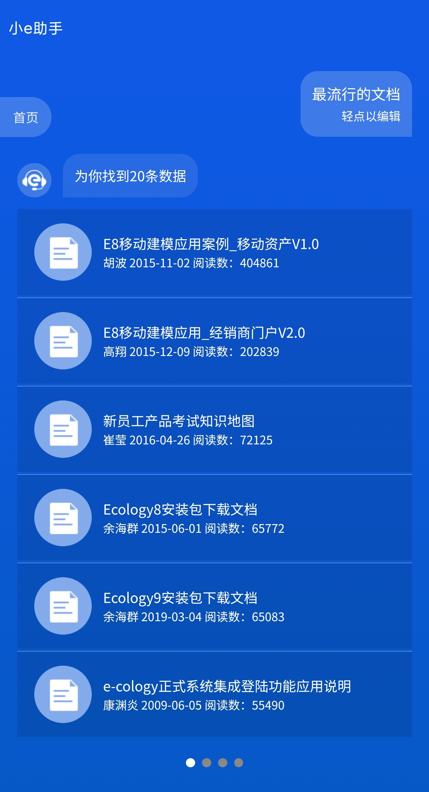  

- 服务端接口返回数据结构  
``` js
 {
        dataType:'WorkflowQuery', //最流行的文档 播报新闻 查一下周鹏飞的项目 查一下报销标 
        anser:'为您找到${list.length}条数据,以下是前50条', 
        list:[
            {
                id = '',
                schema = 'NEWS',//NEWS DOC 最流行的文档 播报新闻
                simpleTitle = '',
                simpleDesc = '',
            },
            ...
        ]
    }
```

### 2.2 培训安排表  

卡片列表：图标＋标题＋说明文字  
点击卡片，进入对应业务页面，可左右滑动多页显示数据。  

- 展示效果  

  

- 服务端接口返回数据结构  
``` js
  {
        dataType:'TrainArrangement', //最近的培训安排
        anser:'为您找到${list.length}条数据,以下是前50条',
        list:[
            {
             img:'x',
             linkURL:'xxx'
            },
            ...
        ]
    }
```

### 2.3 聊天信息表  

消息图标＋标题文字。点击卡片，可直接到对应的聊天页面发消息。  

- 展示效果  

  

- 服务端接口返回数据结构  
``` js
    {
        dataType:'Discussion', //发送消息到群组
        list:[{
            discussionId:1, //讨论组id
            discussionName:'开发小组', //讨论组名称
          
        }]
    }
```

### 2.4 日程信息表  

日历图标＋日期时间＋简短说明＋标题。  
点击卡片，可进入具体的日程业务页面。  

- 展示效果  

  

- 服务端接口返回数据结构  
``` js
    {
        dataType:'ScheduleQuery', //我的日程
        list:[{
            id:'',
            schema:'Doc', //页面跳转的类型
            BEGINDATE:'2019-06-10',//开始的日期
            BEINGTIME:'13:12',//开始时间
            simpleDesc:'张三',//简述
            simpleTitle:'新建日程测试',//日程标题
            CREATEDATE:'2019-06-10'//日程创建时间
        }]
    }
```

## 3. 数据卡片  

### 3.1 简易数据表  

查询人员座位时，显示的建议数据表。  
数据表不可操作；数据表底部可添加操作入口（如：楼层图），点击可进入所需业务页面。  

- 展示效果  

  

- 服务端接口返回数据结构  
``` js
    {
        dataType:'Seat', //位置 业绩情况
        answer:'为您找到${list.length}条数据,以下是1-20条',
        list:[{
           title:'xx',
           items:[
               {name:'xxx',value:'xxx},
               {name:'xxx',value:'xxx},
           ]
        }]
    }
```

### 3.2 排序数据表  

排序列表：序列号＋标题＋简要说明文字（副标题）  
点击每行，可进入查看所点击的业务接口页面。  

- 展示效果  

  
 
- 服务端接口返回数据结构  
``` js
 item.__data = {
        dataType:'LCRank', //流出效率
        anser:'',
        list:[{
          name:'内部留言',
          num:'1.46'
        }]
    }
```

### 3.3 多行分组数据表  

例如“考勤情况”一类的数据，需要按分组显示行列数据信息的业务，可使用如下数据表。  

- 展示效果  

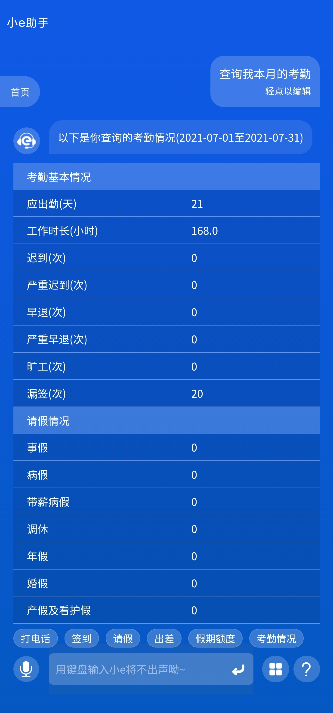  

- 服务端接口返回数据结构  
``` js
    {
        dataType:'Schedule', //查询我本月的考勤情况
        list:[{
            title:'以下是您查询的假期情况',
            detail:[
                {  name:"应出勤（天）",
                   value:"1"
                },
                {  name:"迟到（次）",
                   value:"0"
                },
            ]
        }]
    }
```

### 3.4 归类统计表  

- 展示效果  

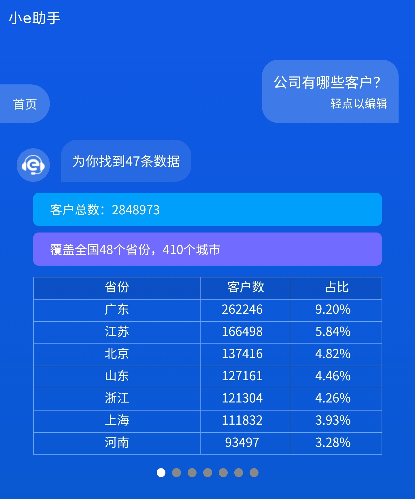  

- 服务端接口返回数据结构  
``` js
    {
        dataType:'Table', //公司有哪些客户
        anser:'', 
        LineBlockList:[ 
            {
                title:'',
                color:'',
                bgColor:''
            } //头部条状
        ],
        tableHeaderList:[
           xx,xx,xx //表格头部tr
        ],
        list:[
            [xx,xx,xx],
            [xx,xx,xx],
            [xx,xx,xx]
            //表格内容td
        ]  
    }
```

## 4. 柱形图  

### 4.1 基础柱状图  

可按业务需求选择可视化图例样式，按对应需求返回数据结构。  

- 渲染到页面展示效果  

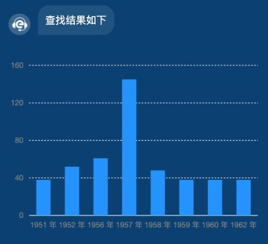  

- 服务端接口返回数据结构  
``` js
{
        dataType:'YunChartBarBase', //选择人员模板进行渲染
        answer:"查询结果如下", //语音播报和显示的文字
        list:[{
            year: '1951 年',
            sales: 38
        }, {
            year: '1952 年',
            sales: 52
        }, {
            year: '1956 年',
            sales: 61
        }, {
            year: '1957 年',
            sales: 145
        }, {
            year: '1958 年',
            sales: 48
        }, {
            year: '1959 年',
            sales: 38
        }, {
            year: '1960 年',
            sales: 38
        }, {
            year: '1962 年',
            sales: 38
        }]
    }
```

### 4.2 百分比堆叠柱状图  

- 渲染到页面展示效果  

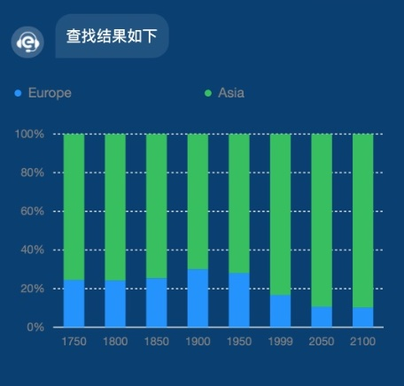  

- 服务端接口返回数据结构  
``` js
{
        dataType:'YunChartBarCascading', //选择人员模板进行渲染
        answer:"查询结果如下", //语音播报和显示的文字
        list:[{
            country: 'Europe',
            year: '1750',
            value: 163,
            percent: 0.24511278195488723
        }, {
            country: 'Asia',
            year: '1750',
            value: 502,
            percent: 0.7548872180451128
        }, {
            country: 'Europe',
            year: '1800',
            value: 203,
            percent: 0.24224343675417662
        }, {
            country: 'Asia',
            year: '1800',
            value: 635,
            percent: 0.7577565632458234
        }, {
            country: 'Europe',
            year: '1850',
            value: 276,
            percent: 0.2543778801843318
        }, {
            country: 'Asia',
            year: '1850',
            value: 809,
            percent: 0.7456221198156682
        }, {
            country: 'Europe',
            year: '1900',
            value: 408,
            percent: 0.3011070110701107
        }, {
            country: 'Asia',
            year: '1900',
            value: 947,
            percent: 0.6988929889298893
        }, {
            country: 'Europe',
            year: '1950',
            value: 547,
            percent: 0.2806567470497691
        }, {
            country: 'Asia',
            year: '1950',
            value: 1402,
            percent: 0.7193432529502309
        }, {
            country: 'Europe',
            year: '1999',
            value: 729,
            percent: 0.16708686683474674
        }, {
            country: 'Asia',
            year: '1999',
            value: 3634,
            percent: 0.8329131331652533
        }, {
            country: 'Europe',
            year: '2050',
            value: 628,
            percent: 0.10651289009497965
        }, {
            country: 'Asia',
            year: '2050',
            value: 5268,
            percent: 0.8934871099050203
        }, {
            country: 'Europe',
            year: '2100',
            value: 828,
            percent: 0.10227272727272728
        }, {
            country: 'Asia',
            year: '2100',
            value: 7268,
            percent: 0.8977272727272727
        }]
    }
```

### 4.3 分组柱状图  

- 渲染到页面展示效果  

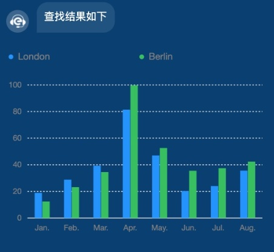  

- 服务端接口返回数据结构  
``` js
 {
        dataType:'YunChartBarGroup', //选择人员模板进行渲染
        answer:"查询结果如下", //语音播报和显示的文字
        list:[{
            name: 'London',
            月份: 'Jan.',
            月均降雨量: 18.9
        }, {
            name: 'London',
            月份: 'Feb.',
            月均降雨量: 28.8
        }, {
            name: 'London',
            月份: 'Mar.',
            月均降雨量: 39.3
        }, {
            name: 'London',
            月份: 'Apr.',
            月均降雨量: 81.4
        }, {
            name: 'London',
            月份: 'May.',
            月均降雨量: 47
        }, {
            name: 'London',
            月份: 'Jun.',
            月均降雨量: 20.3
        }, {
            name: 'London',
            月份: 'Jul.',
            月均降雨量: 24
        }, {
            name: 'London',
            月份: 'Aug.',
            月均降雨量: 35.6
        }, {
            name: 'Berlin',
            月份: 'Jan.',
            月均降雨量: 12.4
        }, {
            name: 'Berlin',
            月份: 'Feb.',
            月均降雨量: 23.2
        }, {
            name: 'Berlin',
            月份: 'Mar.',
            月均降雨量: 34.5
        }, {
            name: 'Berlin',
            月份: 'Apr.',
            月均降雨量: 99.7
        }, {
            name: 'Berlin',
            月份: 'May.',
            月均降雨量: 52.6
        }, {
            name: 'Berlin',
            月份: 'Jun.',
            月均降雨量: 35.5
        }, {
            name: 'Berlin',
            月份: 'Jul.',
            月均降雨量: 37.4
        }, {
            name: 'Berlin',
            月份: 'Aug.',
            月均降雨量: 42.4
        }]
    }
```

### 4.4 基础条形图  

- 渲染到页面展示效果  

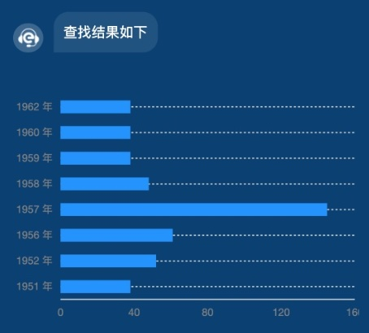  

- 服务端接口返回数据结构  
``` js
 {
        dataType:'YunChartStripBase', //选择人员模板进行渲染
        answer:"查询结果如下", //语音播报和显示的文字
        list:[{
            year: '1951 年',
            sales: 38
        }, {
            year: '1952 年',
            sales: 52
        }, {
            year: '1956 年',
            sales: 61
        }, {
            year: '1957 年',
            sales: 145
        }, {
            year: '1958 年',
            sales: 48
        }, {
            year: '1959 年',
            sales: 38
        }, {
            year: '1960 年',
            sales: 38
        }, {
            year: '1962 年',
            sales: 38
        }]
    }
```

### 4.5 堆叠条形图  

- 渲染到页面展示效果  

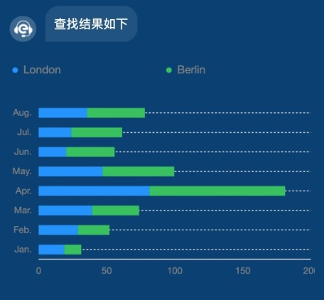  

- 服务端接口返回数据结构  
``` js
  {
        dataType:'YunChartStripCascading', //选择人员模板进行渲染
        answer:"查询结果如下", //语音播报和显示的文字
        list:[{
            name: 'London',
            月份: 'Jan.',
            月均降雨量: 18.9
        }, {
            name: 'London',
            月份: 'Feb.',
            月均降雨量: 28.8
        }, {
            name: 'London',
            月份: 'Mar.',
            月均降雨量: 39.3
        }, {
            name: 'London',
            月份: 'Apr.',
            月均降雨量: 81.4
        }, {
            name: 'London',
            月份: 'May.',
            月均降雨量: 47
        }, {
            name: 'London',
            月份: 'Jun.',
            月均降雨量: 20.3
        }, {
            name: 'London',
            月份: 'Jul.',
            月均降雨量: 24
        }, {
            name: 'London',
            月份: 'Aug.',
            月均降雨量: 35.6
        }, {
            name: 'Berlin',
            月份: 'Jan.',
            月均降雨量: 12.4
        }, {
            name: 'Berlin',
            月份: 'Feb.',
            月均降雨量: 23.2
        }, {
            name: 'Berlin',
            月份: 'Mar.',
            月均降雨量: 34.5
        }, {
            name: 'Berlin',
            月份: 'Apr.',
            月均降雨量: 99.7
        }, {
            name: 'Berlin',
            月份: 'May.',
            月均降雨量: 52.6
        }, {
            name: 'Berlin',
            月份: 'Jun.',
            月均降雨量: 35.5
        }, {
            name: 'Berlin',
            月份: 'Jul.',
            月均降雨量: 37.4
        }, {
            name: 'Berlin',
            月份: 'Aug.',
            月均降雨量: 42.4
        }]
    }
```

### 4.6 人口金字塔  

- 渲染到页面展示效果  

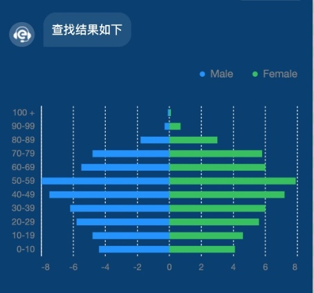  

- 服务端接口返回数据结构  

``` js
{
        dataType:'YunChartStripGroup', //选择人员模板进行渲染
        answer:"查询结果如下", //语音播报和显示的文字
        list:[{
            gender: 'Male',
            value: -4.4,
            cate: '0-10'
        }, {
            gender: 'Male',
            value: -4.8,
            cate: '10-19'
        }, {
            gender: 'Male',
            value: -5.8,
            cate: '20-29'
        }, {
            gender: 'Male',
            value: -6.2,
            cate: '30-39'
        }, {
            gender: 'Male',
            value: -7.5,
            cate: '40-49'
        }, {
            gender: 'Male',
            value: -8.0,
            cate: '50-59'
        }, {
            gender: 'Male',
            value: -5.5,
            cate: '60-69'
        }, {
            gender: 'Male',
            value: -4.8,
            cate: '70-79'
        }, {
            gender: 'Male',
            value: -1.8,
            cate: '80-89'
        }, {
            gender: 'Male',
            value: -0.3,
            cate: '90-99'
        }, {
            gender: 'Male',
            value: -0.1,
            cate: '100 +'
        }, {
            gender: 'Female',
            value: 4.1,
            cate: '0-10'
        }, {
            gender: 'Female',
            value: 4.6,
            cate: '10-19'
        }, {
            gender: 'Female',
            value: 5.6,
            cate: '20-29'
        }, {
            gender: 'Female',
            value: 6.0,
            cate: '30-39'
        }, {
            gender: 'Female',
            value: 7.2,
            cate: '40-49'
        }, {
            gender: 'Female',
            value: 7.9,
            cate: '50-59'
        }]
    }
```

## 5. 饼图  

### 5.1 基础环状图  

- 渲染到页面展示效果  

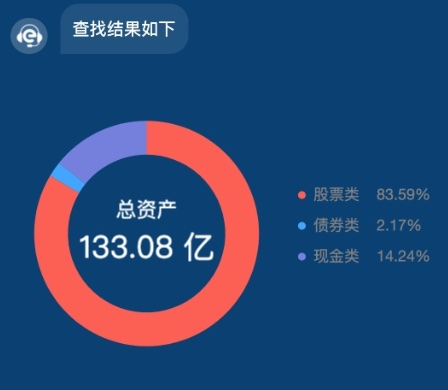  

- 服务端接口返回数据结构  
``` js
 {
        dataType:'YunChartCircleBase', //选择人员模板进行渲染
        answer:"查询结果如下", //语音播报和显示的文字
        list:[{
            name: '股票类',
            percent: 83.59,
            price: 83.59,
            unit:'亿'
        }, {
            name: '债券类',
            percent: 2.17,
            price: 2.17,
            unit:'亿'
        }, {
            name: '现金类',
            percent: 14.24,
            price: 14.24,
            unit:'亿'
        }]
    }
```

### 5.2 基础饼状图  

- 渲染到页面展示效果  

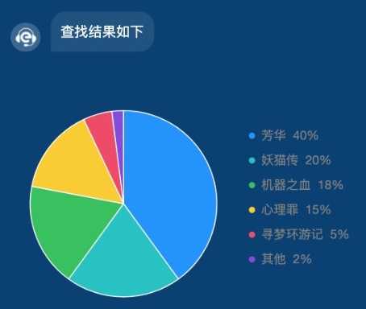  

- 服务端接口返回数据结构  
``` js
  {
        dataType:'YunChartPieBase', //选择人员模板进行渲染
        answer:"查询结果如下", //语音播报和显示的文字
        list:[{
            name: '芳华',
            percent: 0.4,
            a: '1'
        }, {
            name: '妖猫传',
            percent: 0.2,
            a: '1'
        }, {
            name: '机器之血',
            percent: 0.18,
            a: '1'
        }, {
            name: '心理罪',
            percent: 0.15,
            a: '1'
        }, {
            name: '寻梦环游记',
            percent: 0.05,
            a: '1'
        }, {
            name: '其他',
            percent: 0.02,
            a: '1'
        }],
        map:{
            芳华: '40%',
            妖猫传: '20%',
            机器之血: '18%',
            心理罪: '15%',
            寻梦环游记: '5%',
            其他: '2%'
        }
    }
```

## 6. 折线图  

### 6.1 基础折线图  

- 渲染到页面展示效果  

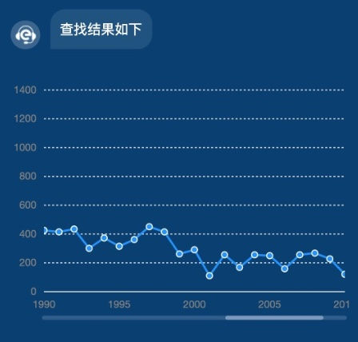  

- 服务端接口返回数据结构  
``` js
   {
        dataType:'YunChartLineSingle', //选择人员模板进行渲染
        answer:"查询结果如下", //语音播报和显示的文字
        list:[{
            "title": "Bohemian Rhapsody",
            "artist": "Queen",
            "release": 1975,
            "year": "1999",
            "rank": "1",
            "count": 978
        }, {
            "title": "Hotel California",
            "artist": "Eagles",
            "release": 1977,
            "year": "1999",
            "rank": "2",
            "count": 1284
        }, {
            "title": "Child In Time",
            "artist": "Deep Purple",
            "release": 1972,
            "year": "1999",
            "rank": "3",
            "count": 1117
        }, {
            "title": "Stairway To Heaven",
            "artist": "Led Zeppelin",
            "release": 1971,
            "year": "1999",
            "rank": "4",
            "count": 1132
        }, {
            "title": "Paradise By The Dashboard Light",
            "artist": "Meat Loaf",
            "release": 1978,
            "year": "1999",
            "rank": "5",
            "count": 1187
        }, {
            "title": "Yesterday",
            "artist": "The Beatles",
            "release": 1965,
            "year": "1999",
            "rank": "6",
            "count": 909
        }, {
            "title": "Angie",
            "artist": "The Rolling Stones",
            "release": 1973,
            "year": "1999",
            "rank": "8",
            "count": 1183
        }, {
            "title": "Bridge Over Troubled Water",
            "artist": "Simon & Garfunkel",
            "release": 1970,
            "year": "1999",
            "rank": "9",
            "count": 1111
        }, {
            "title": "A Whiter Shade Of Pale",
            "artist": "Procol Harum",
            "release": 1967,
            "year": "1999",
            "rank": "10",
            "count": 1190
        }, {
            "title": "Hey Jude",
            "artist": "The Beatles",
            "release": 1968,
            "year": "1999",
            "rank": "11",
            "count": 1037
        }, {
            "title": "House Of The Rising Sun",
            "artist": "The Animals",
            "release": 1964,
            "year": "1999",
            "rank": "13",
            "count": 543
        }, {
            "title": "Goodnight Saigon",
            "artist": "Billy Joel",
            "release": 1983,
            "year": "1999",
            "rank": "14",
            "count": 748
        }, {
            "title": "Dancing Queen",
            "artist": "ABBA",
            "release": 1976,
            "year": "1999",
            "rank": "16",
            "count": 1111
        }, {
            "title": "Another Brick In The Wall",
            "artist": "Pink Floyd",
            "release": 1979,
            "year": "1999",
            "rank": "17",
            "count": 1266
        }, {
            "title": "Sunday Bloody Sunday",
            "artist": "U2",
            "release": 1985,
            "year": "1999",
            "rank": "18",
            "count": 1087
        }, {
            "title": "Tears In Heaven",
            "artist": "Eric Clapton",
            "release": 1992,
            "year": "1999",
            "rank": "21",
            "count": 435
        }]
    }
```

### 6.2 折线对比图  

- 渲染到页面展示效果  

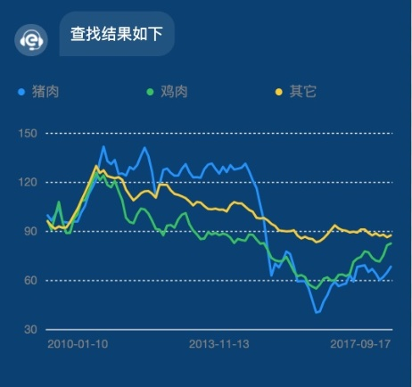  

- 服务端接口返回数据结构  
``` js
   {
        dataType:'YunChartLineContrast', //选择人员模板进行渲染
        answer:"查询结果如下", //语音播报和显示的文字
        list:[{
            "date": "2010-01-10",
            "type": "猪肉",
            "value": 99.9
        },
        {
            "date": "2010-01-10",
            "type": "鸡肉",
            "value": 96.6
        },
        {
            "date": "2010-01-10",
            "type": "其它",
            "value": 96.2
        },
        {
            "date": "2010-02-10",
            "type": "猪肉",
            "value": 96.7
        },
        {
            "date": "2010-02-10",
            "type": "鸡肉",
            "value": 91.1
        },
        {
            "date": "2010-02-10",
            "type": "其它",
            "value": 93.4
        }]
    }
```

## 7. 集成到第三方APP  

### 7.1 APP需要自己实现的方法  

::: warning 必须提供的环境变量UserEnv
在window.App对象定义环境变量UserEnv  
UserEnv:wx为wx环境的变量，app为app的环境变量
:::  

- 开发者自行在全局定义app对象，必须提供的方法  

``` js
//开始录音   传入波纹大小和录音结果		
App.continueSpeech({'changeVoice': (string)=>{
	//持续改变波纹的回调
},'continueSpeechend': ({result:'你好'})=>{
	//录音结束的回调
},'onContinueSpeech': ({result:'你好啊！'})=>{
	//持续录音的回调
}})
//停止录音
App.stopVoive()
//新窗口打开
App.openInNewWindow(url:string)
 //获取地理位置
App.getLocation({
	success:function(res){
		/** {
		 * 	longitude:经度，
		 * 	latitude:维度，
		 * 	address:位置
		 * }*/
	},
	fail:function(res){
		/** {
		 * 	errMsg:错误信息，
		 * }*/
	}
})
//拨打电话
App.tel(tenlno:string)
//发送短信
App.textMessage(tenlno:string)
//创建单聊
App.initiatePrivateChat(id:string,content:string)
//发送名片
App.sendPersonCard(targetid:string,personid:string)
//发送地理位置
App.sendLocation(address:string,latitude:string,longitude:string,targetid:string)
```

### 7.2 Android需要注意的  

调用方法传的参数是对象，Android需要搭配JsBridge取得对象参数  
[https://github.com/lzyzsd/JsBridge](https://github.com/lzyzsd/JsBridge)
