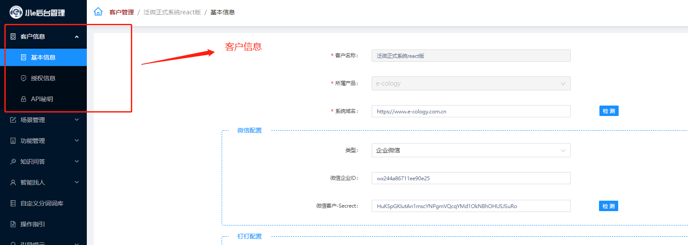

## 1. 注册登录  
:::tip 注意
小e后台管理系统 是一个配置系统，基于算法模型的支撑，通过配置意图，对接小e助手，实现智能OA操作的便捷实现。在后台的配置会影响到小e助手的使用，请仔细查阅说明，并提前联系技术人员沟通需求实现配置方式，谨慎操作。
:::
- 小e后台管理系统网址：[https://admin.easst.cn](https://admin.easst.cn)

### 1.1 注册账号
请填写正确的信息，完成注册。如有账号，请直接登录。  

### 1.2 登录账号
注册成功，即可通过账号（手机号）登录。如忘记密码，可通过手机号验证找回。  

### 1.3 关联API密钥信息
登录系统，未 “关联客户” 时，系统内无数据信息。需要申请非标功能，获得API信息。  
**（AppId & AppSecret   在 ecology/WEB-INF/prop/easst.properties中获取）**  
获得秘钥后，点击 “关联客户” ，填入API信息，即可关联到该客户。  
同一账号支持关联多个客户。  

若关联失败，请联系管理员提供帮助。  

## 2. 管理系统结构
登录成功后，可看到以下页面。点击客户名称，即可进入客户菜单层级。  

### 2.1 配置分区  

::: tip 基础配置：客户信息  
- 基本信息：可以看到当前客户的客户名称，所属产品，可以自行配置系统域名，如果此客户对接了企业微信和钉钉，也可以在此处配置相关的信息。  
- 授权信息：可以看到此客户的创建时间、授权时长、试用时长、授权到期时间  
- API秘钥：可以看到该客户的AppID和AppSecret
:::  

::: tip 使用配置：场景管理、功能管理、知识问答、智能找人  
这部分是小e助手使用前要进行的业务配置，可根据企业自身业务，按需配置。
- 场景管理：包括标准场景和自建场景，标准场景及系统自带功能，可关闭。自建场景由用户自己建一些自定义的使用场景。  
- 功能管理：场景要关联相应的功能，比如考勤场景就包括签到、签退、出差等场景，这些场景要在小e助手实现还需要关联相应的功能。
- 知识问答：可配置实现一问一答FAQ形式的功能。
- 智能找人：可配置实现智能人员查找功能。如：“我想转正找谁？” “我想领用资料要找谁？” "发票问题找谁处理？“，可找到相关人员，并跳转到发消息的界面。
:::  

::: tip 其他配置：自定义分词词库、操作指引、引导提示  
- 自定义分词词库：可配置小e未识别出的专有名词，提高语音识别率。
- 操作指引：可对已配置的业务功能提供操作指引，引导用户对小e发出正确的指令，正确的操作达到想要的快捷办公。
- 引导提示：可个性化设置小e助手端的固定问答和批次命令。
:::

### 2.2 基础名词  

::: tip 场景  
用小e实现的业务场景分类和具体场景。  
比如请假就属于考勤管理场景分类下的请假场景，签到和签退就是考勤管理场景分类中打卡场景下的子场景。
:::  

::: tip 功能  
场景对应的功能实现，多个场景可以配置同一个功能。
如：#查询人员#、#出差#、#请假#、#查询文档#、#找人#、#扫一扫#、#报销#、#记账# 等。
:::  

::: tip 语料  
在小e的实际操作中使用的语言材料，即发出指令时的文字话术。  
如：“ 明天我要出差 ” 、“帮我请三天年假”、“帮我找下研发部的李天” 等（下文都将以 “ XX ” 的格式表示 XX语料）
:::  

::: tip 词典  
提供数据的存储。用小e实现的业务表单中，通常有用下拉选择、搜索选择的需求，所用的选择项，即可添加于词典中。在功能配置时，为这些下拉搜索项 提供词典数据。  
如：{人员词典}、{出差类型}、{请假类型}、{报销类型} 等（下文都将以 {XX} 的格式表示 XX词典）
:::  

## 3. 确认基本信息

::: tip 说明：
- 系统域名：关联客户后需要填写正确的企业系统域名地址。 
- 微信企业ID & 微信客户Secret：如需使用微信版小e，需要先配置此处。不使用可不填。  
- 钉钉：如需对接钉钉版小e，需要先配置钉钉的配置项。不使用可不填。  
- 微信、钉钉上对接小e，需要云桥认证等，请先联系相关项目人员或管理员确认。
:::

## 4. 如需解除关联客户
- 进入《API秘钥》页面，点击【重置】按钮，输入验证手机号，进行验证。
- 重置后，该企业客户将与所有关联客户的账号解除关联。此页内也将会产生新的API秘钥信息，并通过手机号验证，将新的API秘钥信息以短信形式发送至验证手机号。  

::: warning 注意：
1. 已解绑账号如需再次关联客户，需要使用新的API秘钥进行关联绑定。
2. 重置后ecology端的配置文件也需同时变更，需手动更改。  
（配置文件路径：ecology\WEB-INF\prop\easst.properties）
:::

